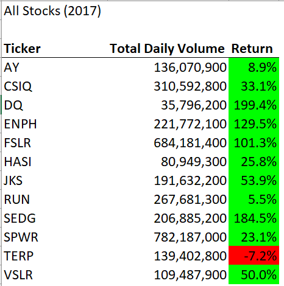
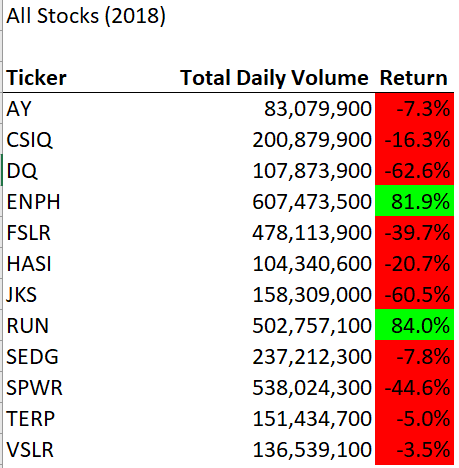

# Using VBA to Conduct Stock Market Analysis

## Overview of Project
For this project, I helped a friend create a program to analyze a set of stocks for 2017 and 2018. Microsoft Visual Basic for Applications, or VBA, was used to complete this effort. We initially looked at a stock his parents had interest in "DQ" but we soon realized this stock was underperforming. We expanded the scope of our analysis to include 12 stocks on the *Trillogy Industrial Average*.

VBA was very helpful in conducting this analysis, as it allowed for us to automate the analysis in a repeatable manner, so if we have access to additional datapoints, we will be able to easily extract valuable insights. Removing **magic numbers** was a game-changer, as the utility of our program expanded drastically. Magic numbers are those which, without looking at the program, seem to magically appear because they have been manually inserted on the developer-end. 

## Results

**Figure 1**

**Figure 2**

## Summary

Re-factoring this code was not a simple task. It was a frustrating and challenging process that left me quetioning, "Why am I even doing this?" more than once during the project. Yes, there was concrete evidence that the re-factoring process sped-up the length of time it took for the program to run, but I was interested in greater returns that I uncovered upong further reflection.

### Pros of Re-factoring
1) The code is *cleaner* and thus easier to read and understand. This makes working in teams a smoother, more effective process.
2) The re-factoring process uncovers bugs that would otherwise be less apparent.
3) The re-factoring process speeds up the amount of time that a program takes to run. Yes - we already discussed this multiple times - however it should be re-emphasized because, while this program was not very complicated, other programs are more complicated and the improved run times will be appreciated as the program complixtity increases. Another by-product of an efficient program is that less memory is consumed, making sharing programs and files easier, especially when sharing via email.

### Cons of Re-factoring
Re-factoring does have some drawbacks, however, beyond being a frustrating process for novice programmers.
1) Re-factoring programs does take time, and in the commercial world, time means resources and money. Evrey business seeks to cut costs, but this is especially critical for start-ups working with limited capital. Although re-factored programming is more robust and adapabtale, if re-factoring the program would lead into missed deadlines and budget overruns, it may need to be limited or held off until time and funding factors allow for the developers to re-factor their program.

